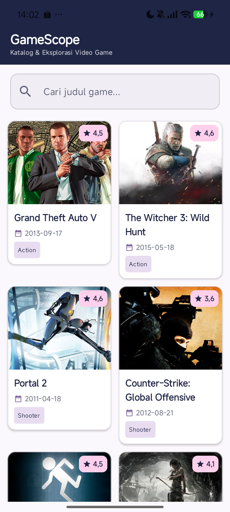
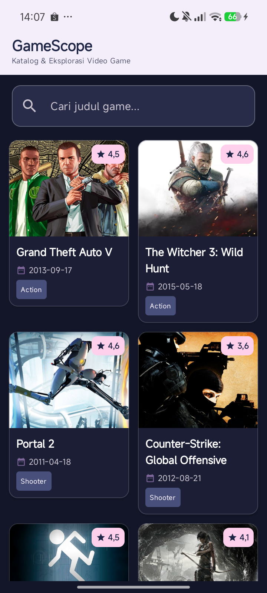
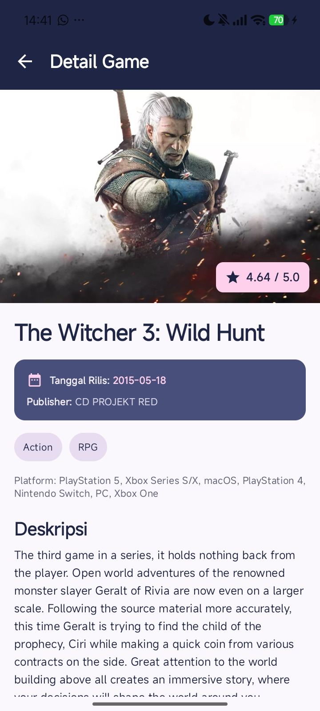
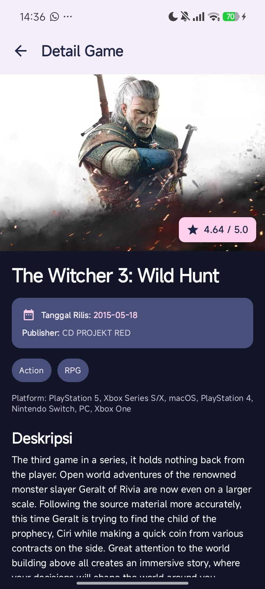
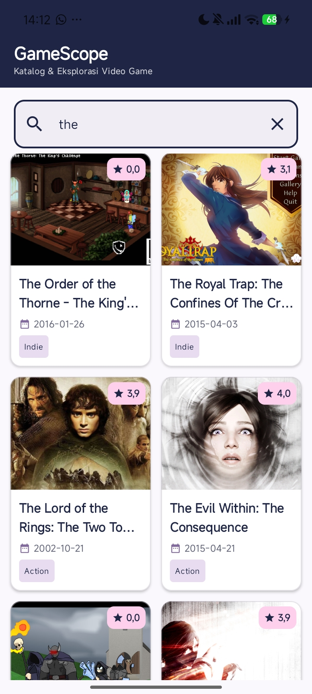
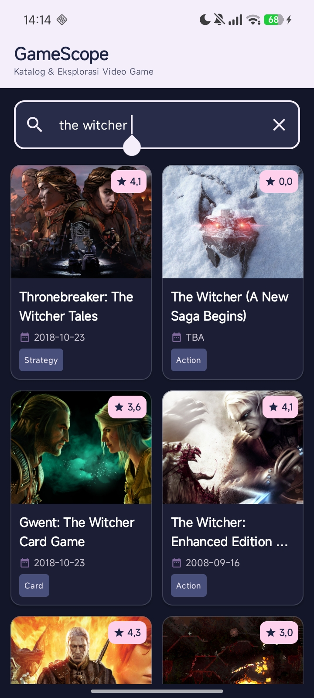

<p align="center">
  
</p>

# GameScope

GameScope adalah aplikasi Android untuk mencari dan mengeksplorasi informasi video game. Data game diambil secara dinamis dari [RAWG Video Games Database API](https://rawg.io/apidocs). Aplikasi dikembangkan menggunakan Kotlin, Jetpack Compose, Material Design 3, dan arsitektur MVVM.

## Identitas

| Data | Keterangan |
| --- | --- |
| Nama | Sani Aprillia Anjani |
| NIM | H1D024011 |
| Shift awal | H |
| Shift baru | F |

## Fitur Aplikasi

- Menampilkan katalog game dalam dua kolom menggunakan `LazyVerticalGrid`.
- Menampilkan nama, rating, tanggal rilis berformat ISO 8601, genre, dan gambar game.
- Mencari game berdasarkan judul melalui RAWG API.
- Menerapkan debounce selama 500 milidetik agar pencarian tidak mengirim request pada setiap perubahan karakter secara langsung.
- Menampilkan detail game berupa judul, rating, tanggal rilis, publisher, genre, platform, gambar, dan deskripsi.
- Menangani kondisi loading, data kosong, error, dan percobaan ulang request.
- Mendukung tema terang dan gelap melalui Material Design 3.

## Screenshot Aplikasi

|                                      Light Mode                                      |                                     Dark Mode                                      |
|:------------------------------------------------------------------------------------:|:----------------------------------------------------------------------------------:|
|    |    |
|  |  |
|  |  |

## Pemenuhan Persyaratan Responsi

| Persyaratan | Implementasi |
| --- | --- |
| Kotlin | Menggunakan `data class`, null safety, lambda, sealed interface, dan coroutine. |
| Jetpack Compose | Seluruh antarmuka dibuat dengan composable, seperti `Scaffold`, `Card`, `OutlinedTextField`, dan `LazyVerticalGrid`. |
| Material Design 3 | Menggunakan komponen Material 3, color scheme, theme, dan typography. |
| Lazy layout | Daftar game ditampilkan menggunakan `LazyVerticalGrid` dua kolom. |
| State dan recomposition | UI mengamati `StateFlow` dengan `collectAsState()` sehingga otomatis melakukan recomposition ketika state berubah. |
| Search functionality | Input pencarian diteruskan ke ViewModel, diberi debounce 500 ms, lalu dikirim sebagai parameter `search` ke RAWG API. |
| Networking | Menggunakan Retrofit dan Gson Converter untuk mengambil data dari RAWG API. |
| MVVM | Kode dipisahkan menjadi lapisan model, repository, ViewModel, dan UI. |
| Home Screen | Menampilkan search bar serta katalog yang berisi judul, rating, tanggal rilis, genre, dan gambar game. |
| Game Detail Screen | Menampilkan judul, rating, deskripsi, tanggal rilis, publisher, genre, platform, dan gambar game. |

## Arsitektur Aplikasi

Aplikasi menggunakan pola MVVM dengan alur data berikut:

```text
RAWG API
   |
Retrofit (ApiInterface)
   |
Repository (GameRepository)
   |
ViewModel (GameViewModel + StateFlow)
   |
Jetpack Compose UI (HomeScreen dan GameDetailScreen)
```

## Implementasi State dan Recomposition

State daftar game direpresentasikan oleh `GameListUiState`, sedangkan state detail menggunakan `GameDetailUiState`. Keduanya memiliki kondisi yang eksplisit, seperti `Loading`, `Success`, dan `Error`.

Pada composable, state dibaca menggunakan `collectAsState()`. Perubahan nilai `StateFlow` pada ViewModel memicu recomposition sehingga UI selalu menampilkan kondisi terbaru. Pencarian juga disimpan sebagai state. Ketika pengguna mengetik, job pencarian sebelumnya dibatalkan dan request baru dijalankan setelah jeda 500 milidetik.

## Networking dan Data RAWG

Base URL yang digunakan adalah:

```text
https://api.rawg.io/api/
```

Endpoint utama:

| Method | Endpoint | Fungsi |
| --- | --- | --- |
| `GET` | `games` | Mengambil daftar game dan melakukan pencarian. |
| `GET` | `games/{id}` | Mengambil detail game berdasarkan ID. |

Data wajib yang ditampilkan dari API meliputi:

- Nama game (`name`)
- Rating (`rating`)
- Tanggal rilis (`released`) dalam format ISO 8601
- Deskripsi (`description_raw` atau `description`)

Data tambahan yang digunakan adalah gambar latar, genre, publisher, dan platform.

## Navigasi

Navigasi dibuat menggunakan Navigation Compose dan memiliki dua route:

- `home` untuk halaman katalog dan pencarian.
- `detail/{gameId}` untuk halaman detail berdasarkan ID game yang dipilih.

## Struktur Proyek

```text
com.responsi.gamescope/
|-- MainActivity.kt
|-- data/
|   |-- model/
|   |   `-- Game.kt
|   `-- repository/
|       `-- GameRepository.kt
|-- network/
|   `-- ApiInterface.kt
|-- ui/
|   |-- screen/
|   |   |-- HomeScreen.kt
|   |   `-- GameDetailScreen.kt
|   |-- theme/
|   |   |-- Color.kt
|   |   |-- Theme.kt
|   |   `-- Type.kt
|   `-- viewmodel/
|       `-- GameViewModel.kt
`-- util/
    `-- GameConstants.kt
```

## Teknologi dan Library

- Kotlin
- Jetpack Compose
- Material Design 3
- Navigation Compose
- ViewModel dan Kotlin Coroutines
- StateFlow
- Retrofit
- Gson Converter
- Coil Compose
- RAWG Video Games Database API

## Cara Menjalankan Aplikasi

1. Clone atau buka repository ini menggunakan Android Studio.
2. Buat API key melalui [RAWG API Documentation](https://rawg.io/apidocs).
3. Isi nilai `RAWG_API_KEY` pada `app/src/main/java/com/responsi/gamescope/util/GameConstants.kt` dengan API key milik sendiri.
4. Lakukan Gradle sync.
5. Jalankan aplikasi pada emulator atau perangkat Android dengan minimal Android 10 (API 29).

## Video Penjelasan Kode

```text

```
